# Pretty

A Go library for pretty-printing any data structure with optional ANSI color support.

## Features

- Pretty-print any Go data type (structs, slices, maps, primitives, etc.)
- Configurable line width for automatic multi-line formatting
- ANSI color support with automatic terminal detection
- Clean, readable output with proper indentation
- Fluent API for easy configuration

## Installation

```bash
go get github.com/jogly/pretty
```

## Usage

### Basic Usage

```go
package main

import (
    "fmt"
    "github.com/jogly/pretty"
)

func main() {
    data := map[string]interface{}{
        "name": "Alice",
        "age": 30,
        "active": true,
        "balance": 123.45,
        "tags": []string{"user", "premium"},
    }

    fmt.Println(pretty.Print(data))
}
```

### Custom Configuration

```go
// Custom width
pp := &pretty.Printer{MaxWidth: 50}
fmt.Println(pp.Print(data))

// Fluent API
output := pretty.New().
    WithMaxWidth(80).
    WithColorMode(pretty.ColorAlways).
    Print(data)
```

### Color Options

```go
// Auto-detect terminal support (default)
printer := pretty.New().WithColorMode(pretty.ColorAuto)

// Always use colors
printer := pretty.New().WithColorMode(pretty.ColorAlways)

// Never use colors
printer := pretty.New().WithColorMode(pretty.ColorNever)
```

## Examples

Visual comparison between this library and `spew.Dump`:

| Pretty Output | Spew Output |
|---------------|-------------|
| 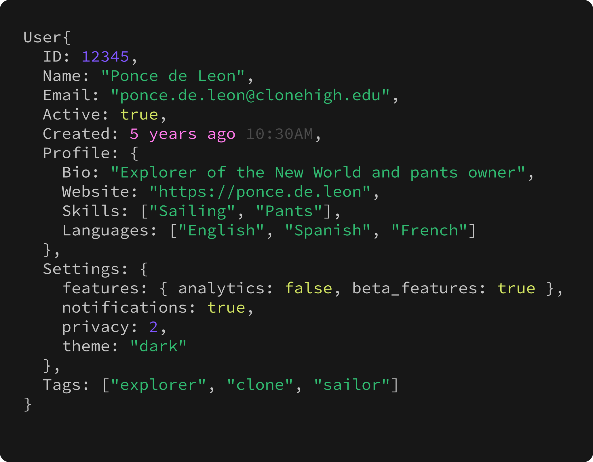 | 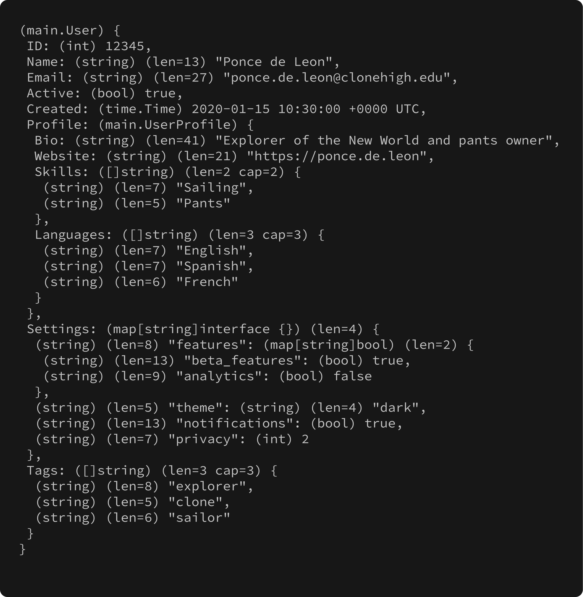 |
| 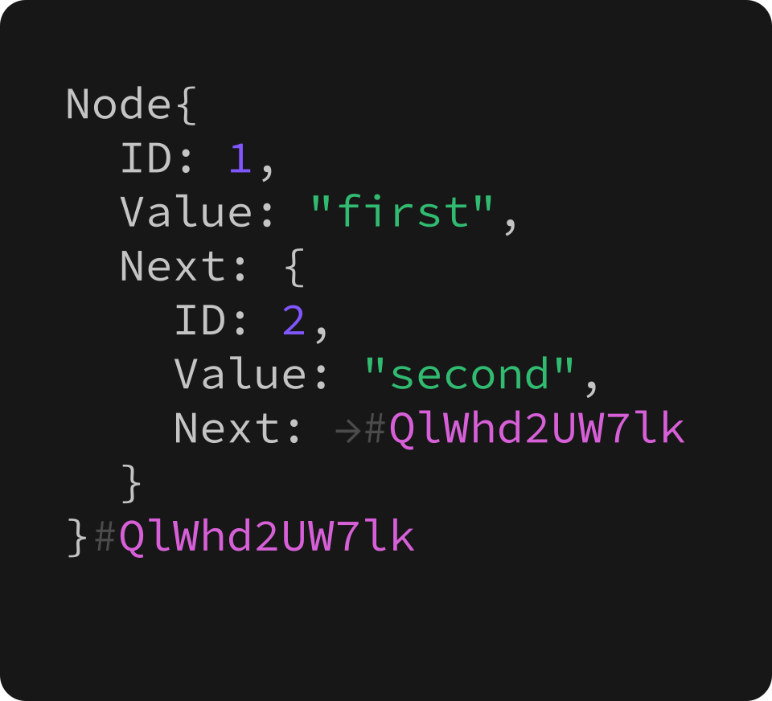 | 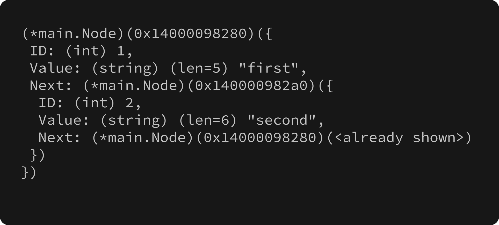 |
| 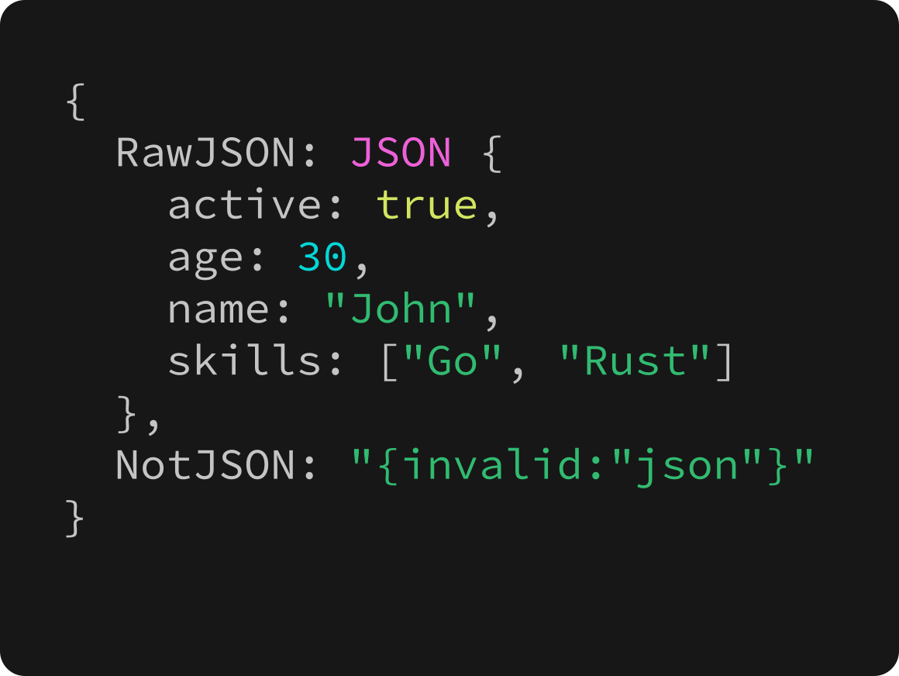 | 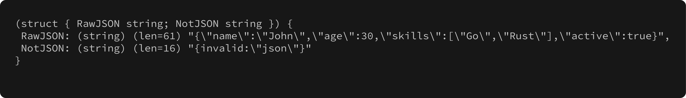 |
| 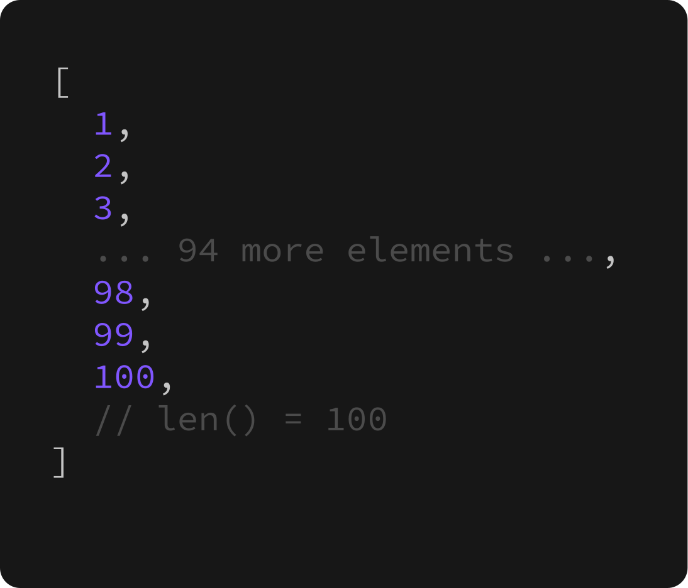 | 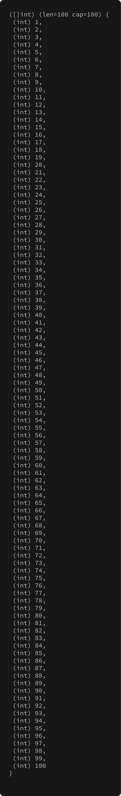 |
| 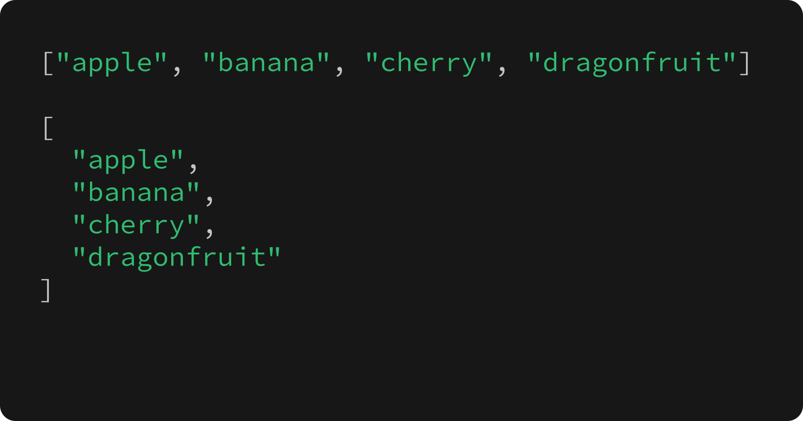 | 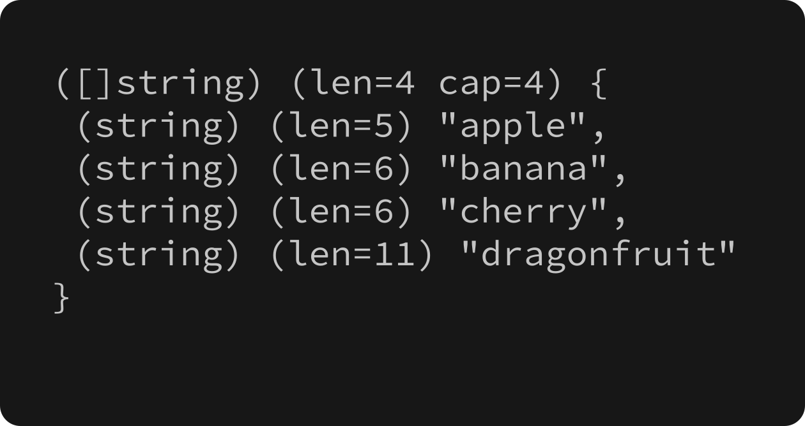 |
| 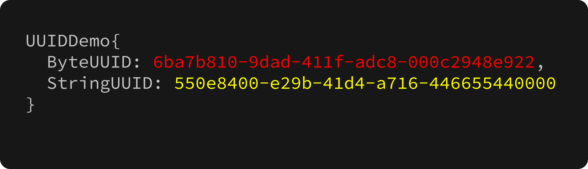 | 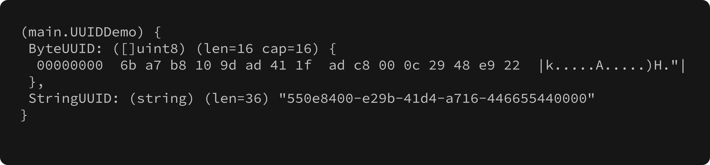 |
| 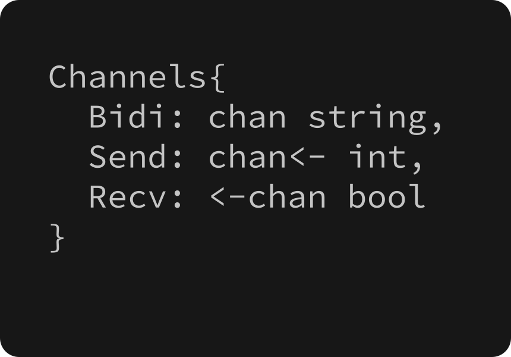 | 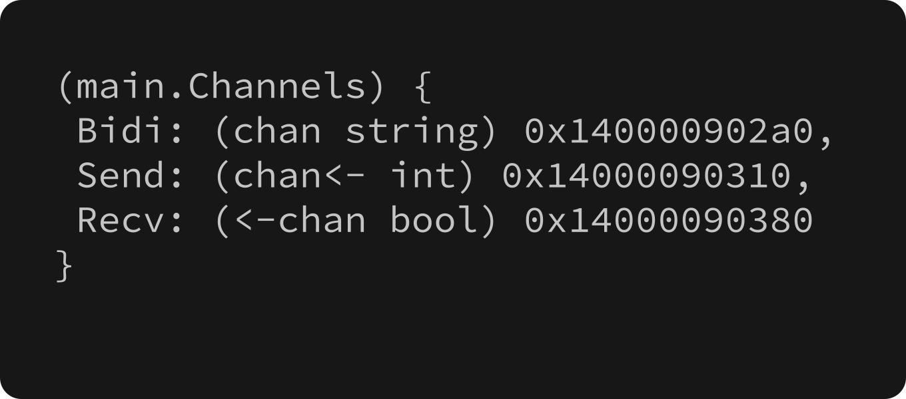 |

> **Note**: Run `./bin/create_images.sh` to generate the example images shown above.
